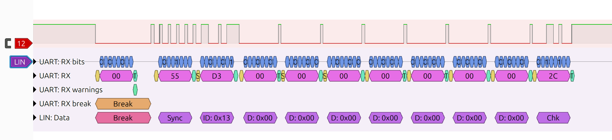

# LIN Decoding

The communications from the vehicle to the trailer control unit are performed over the thinner middle wire in the connector (see [X041.md](./X041.md)) which communicate via a [Local Interconnect Network](https://en.wikipedia.org/wiki/Local_Interconnect_Network), ie LIN. Notably, LIN is not CAN (Controller Area Network), but instead is a cheaper and simpler serial communication protocol that is bidirectional via a single communication wire.

During Phase 0 of the project this page will (hopefully) document the communication happening via the LIN wire and identify the message(s) that provide the information we need to run the trailer lights.

## Target information

This is the information that we definitely will need to read from the LIN to activate the correct lights.

- Brake light status
- Left/Right turn signal status
    - Will the messages indicate the current state of the light within the cycle (on/off) or instead just that left/right is requested?
    - Are hazard lights communicated differently?
- Taillight/Headlight status
    - Specifically the taillights are what is required, but that may only be communicated by if the headlights are active
    - If headlights only, regular vs brights may be communicated differently?

## Hardware Info

To connect to the vehicle and read the data I am planning on using an ESP32 with one of the serial RX pins connected to the LIN wire. Since the LIN uses 12V and the ESP32 is 3V3 and we only need to read data, a simple voltage divider to cut the voltage to about 1/5 of normal should suffice to prevent the ESP32 from being overvolted. I plan on powering the ESP32 directly from the 12V wire via the VIN pin and use the onboard regulator, but in the future a separate (probably switching) regulator to drop to 3V3 that can definitely handle up to about 20V should be used instead. 

I am opting for an ESP32 because WiFi capability means I can update the firmware and get data without having to run a wire to the controller from my computer (meaning I can hopefully sit in the drivers seat and read data as I activate things) and because there are [existing LIN libraries](https://github.com/iDoka/awesome-linbus) for the ESP32. I may instead swap to a Raspberry Pi Pico W in the future, or to a custom RP2040/RP2350 board. Using a standard and relatively inexpensive development board means that everything is easily replicated by anyone else wanting to create a custom controller using this information.

The source code provided in this project is set up to use PlatformIO via Visual Studio Code, which should make it relatively simple to update and flash on your own hardware.

## LIN Information

There are some basic settings for the LIN bus that seems to be common between at least the LIN bus for the trailer and the inductive charger:

- LIN checksum version: 2
- Baudrate: 19,200 bits/s
- Data length: variable

Example trace from the inductive charger LIN bus:

Further testing indicates that the same data looks to be sent over both LIN buses. The light info for the trailer can be read over the LIN for the inductive charger, which makes debugging much easier since that can be read from within the cabin.

### Reading the Lights Data

As you can tell if you look at the raw data below, the key message for the data on which lights are lit is the message with ID `0x0F`. This message has a single byte of data containing flags for the relevant lights.

In least significant bit first ordering (how the data is sent over UART):
- Bit 1: Left turn signal
- Bit 2: Right turn signal
- Bit 3: Headlights
- Bit 4: Brakes
- Bit 5: Unknown
- Bit 6: Reverse lights
- Bits 7-8: Unknown

Both of the turn signals are also marked as active when the brakes are pressed, so that doesn't need to be handled separately.

This means that mapping the message to the lights on a four-pin connector is just:
- left/yellow maps to the first bit
- right/green maps to the second bit
- taillights/brown maps to the third bit

#### Examples:

- Driving with the headlights on: `00100000` = 0x08
- Headlights on, turning left: `10100000` = 0x09
- Slowing down with brakes, headlights off: `11010000` = 0x0A

### LIN Frames

This is a raw list of the different ids and sample data seen for the Trailer LIN bus. Number are hex unless otherwise specified. ID is the actual identifier, PID is the raw Protected Identifier Field including parity bits.

#### 0x0F - Light States
- ID: 0x0F
- PID: 0xCF

IDLE
- Data: 1 byte
    - 0x00
- Checksum: 0x30

LEFT TURN
- 0x01
- Checksum: 0x2F

RIGHT TURN
- 0x02
- Checksum: 0x2E

LIGHTS ON
- 0x04
- Checksum: 0x2C

BRAKES
- 0x0B
- Checksum: 0x25

DRIVE - HOLD ACTIVE
- 0x0F
- Checksum: 0x21

REVERSE - HOLD
- 0x2F

REVERSE - MOVING
- 0x24

#### 0x10
- ID: 0x10
- PID: 0x50
- No data, expecting response

#### 0x11
- ID: 0x11
- PID: 0x11
- No data, expecting response

#### 0x13
- ID: 0x13
- PID: 0xD3
- Data: 7 bytes
    - 0x00 (for all bytes)
- Checksum: 0x2C

#### 0x18
- ID: 0x18
- PID: 0xD8
- No data, expecting response

#### 0x19
- ID: 0x19
- PID: 0x99
- No data, expecting response

#### 0x29 - Driver Side Wireless Charger
- ID: 0x29
- PID: 0xE9
- Data: 8 bytes
    - 0x02
    - 0x00
    - 0x1C
    - 0xF3
    - 0x01
    - 0x88
    - 0xFF
    - 0xFF
- Checksum: 0x7A

Driver IC Charging
- The first byte changes from 2 to 3, to 8, 9, and then 0x0A when a device is placed on the driver's side charger, but not the passenger side.

0x02 is idle,
0x03 is testing for a device,
0x08 and 0x09 seem to be preparing,
0x0A is actively charging.

The second byte seems to also be a state identifier: 0 for no device, 1 for present but not charging, 2 for charging.

#### 0x2A - Passenger Side Wireless Charger
- ID: 0x2A
- PID: 0x6A
- Data: 8 bytes
    - 0x02
    - 0x00
    - 0x00
    - 0x1C
    - 0xF3
    - 0x01
    - 0x88
    - 0xFE
- Checksum: 0xFA
