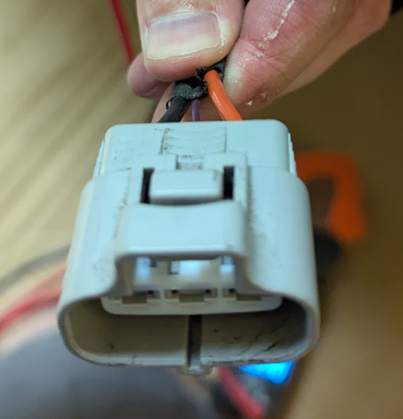

# X041 - The Gray Connector

X041 is the identifier of the "gray connector" for the trailer wiring harness in the Tesla service manual. The part is Tesla Part Number `1450449-00-A` and connector part number `Sumitomo 6189-0165`. The mating part that you would need to source to seamlessly connect to the connector in the vehicle is `Sumitomo 6188-0129` which can be found online via a variety of retailers, including AliExpress. I personally purchased mine from [CorsaTechnic](https://www.corsa-technic.com/item.php?item_id=1846) for about $5 plus $5 shipping, since shipping was from the US. I chose pins and seals fitting 3.00 mm2 wire, as that is what is used for the power/ground wires on the Tesla connector.

The Tesla side of the connector has three wires, on the outside are red 12V and black ground in 12 gauge (TODO: confirm size) wire with the middle 18(?) gauge green wire being a Local Interconnect Network interface (see [LIN Decoding](./LIN-Decoding.md)) used for communicating vehicle status.

